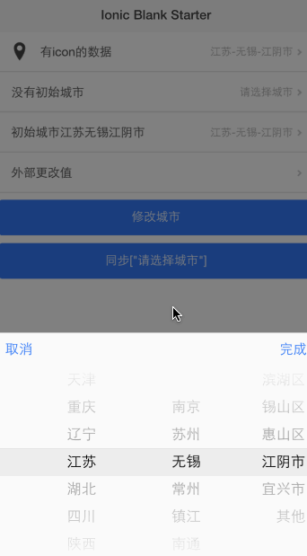

###描述:
模拟iOS选择器做的城市三级联动。

插件适用于 ionic v1.3.0 delhi版本以及之前。

###效果图:


###安装:
1.   `git clone https://github.com/minh8023/ionic-citypicker`

	下载所有文件放到`www/lib`目录下

2. 引入文件
	在 `index.html`文件中引入 `ionic-citypicker.min.js`
	
	````html
	<script src="lib/ionic-citypicker/dist/ionic-citypicker.min.js"></script>
	````    
3. 在 `app.js`里写入文件依赖

	````html
	angular.module('myApp', ['ionic-citypicker'])
````
4.  html部分，需要城市选择的地方写入
	
	````html
	<ionic-city-picker options='vm.CityPickData1'></ionic-city-picker>
   	<ionic-city-picker options='vm.CityPickData2'></ionic-city-picker>
   	<ionic-city-picker options='vm.CityPickData3'></ionic-city-picker>
   	<ionic-city-picker options='vm.CityPickData4'></ionic-city-picker>
    <div class="button button-positive button-block" ng-click="vm.change()">
      修改城市
    </div>
    <div class="button button-positive button-block" ng-click="vm.sync()">
      同步{{vm.CityPickData2.areaData}}
    </div>
	````   
5.  js部分demo`controller.js`
	
	````js
	app.controller('cityCtrl', function($scope) {
	  var vm=$scope.vm={};
	  vm.cb = function () {
	    console.log(vm.CityPickData1.areaData)
	    console.log(vm.CityPickData2.areaData)
	    console.log(vm.CityPickData3.areaData)
	    console.log(vm.CityPickData4.areaData)
	  }
	  //例1
	  vm.CityPickData1 = {
	    areaData: [],
	    backdrop: true,
	    backdropClickToClose: true,
	    defaultAreaData: ['江苏', '无锡', '江阴市'],
	    buttonClicked: function () {
	      vm.cb()
	    },
	    tag: '-',
	    iconClass: 'ion-location',
	    title: '有icon的数据'
	  }
	  //例2
	  vm.CityPickData2 = {
	    areaData: ['请选择城市'],
	    title: '没有初始城市',
	    hardwareBackButtonClose: false
	  }
	  //例3
	  vm.CityPickData3 = {
	    areaData: [],
	    defaultAreaData: ['江苏', '无锡', '江阴市'],
	    title: '初始城市江苏无锡江阴市'
	  }
	  //例4
	  vm.CityPickData4 = {
	    areaData: [],
	    title: '外部更改值',
	    watchChange: true
	  }
	  vm.change = function () {
	    console.log('change')
	    vm.CityPickData4.areaData = ['上海', '徐汇区']
	  }
	  vm.sync = function () {
	    console.log('sync')
	    vm.CityPickData4.areaData = vm.CityPickData2.areaData
	  }
	})
````

###具体配置
* `areaData` Array required 城市数据绑定

* `buttonText` String 按钮名称 默认“完成”

* `buttonClicked` Expression 点击“确定”后的回调函数

* `backdropClickToClose` Boolean  点击空白出关闭窗口 默认`false`

* `barCssClass` String 自定义自己的bar class

* `backdrop` Boolean 遮罩层 默认`true`

* `cssClass` String 自定义自己的class

* `defaultAreaData` Array 初始城市 eg: ['江苏', '无锡', '江阴市']

* `hardwareBackButtonClose` Boolean  安卓硬件返回 默认`true`

* `iconClass` String 没有值的时候不显示图标 eg: ion-location

* `tag` String 城市之间的分割符号 默认“－”

* `title ` String 标题

* `watchChange ` Boolean 默认`false` 外部更改城市数据绑定值 eg:例四

###目录结构

````html
	|_bower.json
	|_demo.gif
	|_dist
	| |_ionic-citypicker.min.js 合成后的js，含js、css、html
	|_gulpfile.js gulp文件
	|_licence.txt
	|_package.json
	|_README.md
	|_src
	| |_js
	| | |_ionic-citypicker-directive.js 增加一个带有onScrollComplete的ionScroll指令
	| | |_ionic-citypicker-service.js 中国城市数据源 323k大小，可根据需求删减
	| | |_ionic-citypicker.js 主js
	| |_style
	| | |_ionic-citypicker.css 样式部分
	| |_templates
	| | |_ionic-citypicker.html
````
`cd ionic-citypicker && npm install`

自定义自己的需要的样式、数据，在`src `下面进行修改，修改完成后执行`gulp`合成`dist/ionic-citypicker.min.js`


